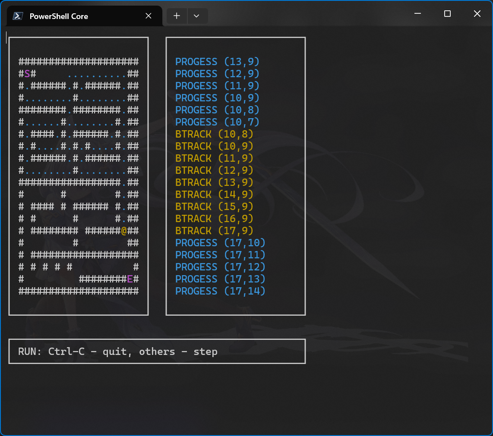

# mazer_win

Solve any 20-by-20 maze interactively.

Windows-compatible port of [CSharperMantle/mazer](https://github.com/CSharperMantle/mazer), the assignment 2.2 for HDU 2023 fall course *Preliminary Program Designing and Algorithms*.

This fork is based on commit [`31e9e11587c732e58255d23b0d73d9eee1563585`](https://github.com/CSharperMantle/mazer/commit/31e9e11587c732e58255d23b0d73d9eee1563585) from the original repository. This repo is only used as a proof-of-concept of curses-interop on Windows, so it will not receive any further updates. **See the original [CSharperMantle/mazer](https://github.com/CSharperMantle/mazer) repo for course reports and relevant updates.**

Current issues:

* [ ] `Ctrl-C` does not work. You need to close the window to exit.

## How to play?

Build with Visual Studio 2022 with C/C++ workload.



On entering game, you will be prompted to make edits to an preloaded maze map. This mode is named "*EDIT mode*". The following controls are available:

* `q`: Quit "EDIT mode"
* `h`, `j`, `k`, `l`: Move the cursor left/down/up/right
* `Space`: Switch cell under cursor between "wall" and "path" (not wall)
* `s`, `e`: Move starting/ending point (terminals, *terms*) to cursor

Here is a example screen under EDIT mode: (legends: `#`: wall; `S`: starting point; `E`: ending point)

```text
┌──────────────────────┐  ┌──────────────────────┐
│                      │  │                      │
│ #################### │  │                      │
│ #S#               ## │  │                      │
│ # ###### # ###### ## │  │                      │
│ #        #        ## │  │                      │
│ ######## ######## ## │  │                      │
│ #      #        # ## │  │                      │
│ # #### # ###### # ## │  │                      │
│ # #    # # #    # ## │  │                      │
│ # ###### # ###### ## │  │                      │
│ #        #        ## │  │                      │
│ ################# ## │  │                      │
│ #      #        # ## │  │                      │
│ # #### # ###### # ## │  │                      │
│ # #    # # #    # ## │  │                      │
│ # ###### # ###### ## │  │                      │
│ #                 ## │  │                      │
│ # ################## │  │                      │
│ #                  # │  │                      │
│ # ######## #######E# │  │                      │
│ #################### │  │                      │
│                      │  │                      │
└──────────────────────┘  └──────────────────────┘

┌────────────────────────────────────────────────┐
│ EDIT: q=run; hjkl=move; Spc=cycle; se=terms    │
└────────────────────────────────────────────────┘
```

After finishing your edits, press `q` as described above to enter "*RUN mode*". In RUN mode, any key press will advance the searching step by 1.

Here is a example screen under EDIT mode: 

Here is a screenshot of RUN mode: (legends: `#`: wall; `@`: current location; `.`: visited path; `S`: starting point; `E`: ending point)

```text
┌──────────────────────┐  ┌──────────────────────┐
│                      │  │                      │
│ #################### │  │ PROGESS (10,7)       │
│ #S#     ..........## │  │ BTRACK (10,8)        │
│ #.######.#.######.## │  │ BTRACK (10,9)        │
│ #........#........## │  │ BTRACK (11,9)        │
│ ########.########.## │  │ BTRACK (12,9)        │
│ #......#........#.## │  │ BTRACK (13,9)        │
│ #.####.#.######.#.## │  │ BTRACK (14,9)        │
│ #.#....#.#.#....#.## │  │ BTRACK (15,9)        │
│ #.######.#.######.## │  │ BTRACK (16,9)        │
│ #........#........## │  │ BTRACK (17,9)        │
│ #################.## │  │ PROGESS (17,10)      │
│ #      #        #.## │  │ PROGESS (17,11)      │
│ # #### # ###### #.## │  │ PROGESS (17,12)      │
│ # #    # # #    #.## │  │ PROGESS (17,13)      │
│ # ###### # ######.## │  │ PROGESS (17,14)      │
│ #            @....## │  │ PROGESS (17,15)      │
│ # ################## │  │ PROGESS (16,15)      │
│ #                  # │  │ PROGESS (15,15)      │
│ # ######## #######E# │  │ PROGESS (14,15)      │
│ #################### │  │ PROGESS (13,15)      │
│                      │  │                      │
└──────────────────────┘  └──────────────────────┘

┌────────────────────────────────────────────────┐
│ RUN: Ctrl-C - quit, others - step              │
└────────────────────────────────────────────────┘
```

On the right you can inspect the algorithm progress. You can exit the program by entering combo `Ctrl-C`.

Once one maze search completes, whether it succeeds or fails, you will be prompted with EDIT mode again, retaining all changes you have made in previous edits.

## Third-party libraries

* [PDCurses](https://github.com/wmcbrine/PDCurses/) (Public domain): terminal I/O library. Flattened and retargeted with VS2022 in directory [`PDCurses_39/`](PDCurses_39/).

## License

```text
BSD 3-Clause License

Copyright (c) 2023, Rong "Mantle" Bao <baorong2005@126.com>

Redistribution and use in source and binary forms, with or without
modification, are permitted provided that the following conditions are met:

1. Redistributions of source code must retain the above copyright notice, this
   list of conditions and the following disclaimer.

2. Redistributions in binary form must reproduce the above copyright notice,
   this list of conditions and the following disclaimer in the documentation
   and/or other materials provided with the distribution.

3. Neither the name of the copyright holder nor the names of its
   contributors may be used to endorse or promote products derived from
   this software without specific prior written permission.

THIS SOFTWARE IS PROVIDED BY THE COPYRIGHT HOLDERS AND CONTRIBUTORS "AS IS"
AND ANY EXPRESS OR IMPLIED WARRANTIES, INCLUDING, BUT NOT LIMITED TO, THE
IMPLIED WARRANTIES OF MERCHANTABILITY AND FITNESS FOR A PARTICULAR PURPOSE ARE
DISCLAIMED. IN NO EVENT SHALL THE COPYRIGHT HOLDER OR CONTRIBUTORS BE LIABLE
FOR ANY DIRECT, INDIRECT, INCIDENTAL, SPECIAL, EXEMPLARY, OR CONSEQUENTIAL
DAMAGES (INCLUDING, BUT NOT LIMITED TO, PROCUREMENT OF SUBSTITUTE GOODS OR
SERVICES; LOSS OF USE, DATA, OR PROFITS; OR BUSINESS INTERRUPTION) HOWEVER
CAUSED AND ON ANY THEORY OF LIABILITY, WHETHER IN CONTRACT, STRICT LIABILITY,
OR TORT (INCLUDING NEGLIGENCE OR OTHERWISE) ARISING IN ANY WAY OUT OF THE USE
OF THIS SOFTWARE, EVEN IF ADVISED OF THE POSSIBILITY OF SUCH DAMAGE.
```
